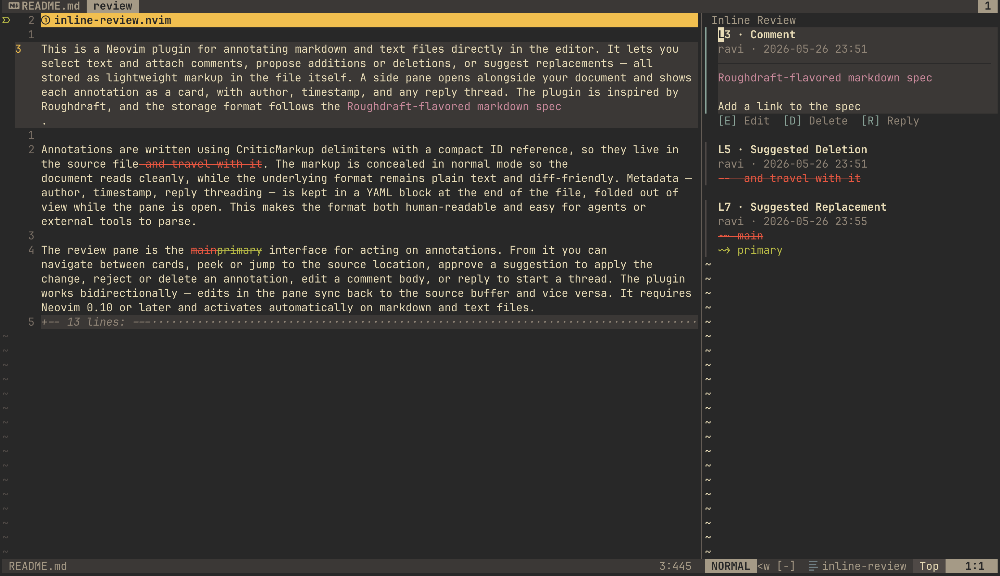

# inline-review.nvim

A Neovim plugin inspired by [Roughdraft](https://www.roughdraft.md/) for annotating markdown and text files directly in the editor. It lets you select text and attach comments, propose additions or deletions, or suggest replacements — all stored as lightweight markup in the file itself, making it both human-readable and easy for agents to collaborate on. 



## Installation

### lazy.nvim

```lua
{ "rsmenon/inline-review.nvim" }
```

The default option sets the pane to 45 columns in width and the author name to your OS username, but these can be changed as shown in the [Configuration](#configuration) section.

The plugin is activated on markdown and text files.

### Claude Code

To use this as a skill to review and annotate `.md` and `.txt` files, paste the following in your Claude code session:

```
Fetch https://github.com/rsmenon/inline-review.nvim/blob/master/assets/skills/inline-review/SKILL.md and install it as a new skill.
```

## Annotation types

### Comment

Select text, press `<leader>rc`, type a comment. The selected text becomes a highlighted anchor. The comment body appears in the review pane.

### Addition

Select the location where text should be inserted, press `<leader>ra`, type the proposed text. Shown in green in both the source and pane.

### Deletion

Select the text to remove, press `<leader>rd`. No input needed — the selected text is immediately marked for deletion. Shown with strikethrough.

### Replacement

Select the text to replace, press `<leader>rr`, type the replacement. The pane shows both the old and new text. On approve, the old text is swapped for the new.

All four types support multi-line selections. When a selection spans multiple lines, each line is annotated separately under the same ID, and the pane shows them as a single card.

## Keymaps

### Source buffer (markdown/text files)

| Key | Mode | Action |
|-----|------|--------|
| `<leader>rp` | n | Toggle review pane |
| `<leader>rc` | v | Comment on selection |
| `<leader>ra` | v | Propose addition at selection |
| `<leader>rd` | v | Propose deletion of selection |
| `<leader>rr` | v | Propose replacement of selection |
| `gd` | n | Jump to review pane card for annotation under cursor |
| `]r` | n | Jump to next annotation (wraps) |
| `[r` | n | Jump to previous annotation (wraps) |

Word motions (`w`, `b`, `e`) are conceal-aware while the pane is open — they skip over hidden markup characters.

### Review pane

| Key | Mode | Action |
|-----|------|--------|
| `j` / `k` | n | Move between cards and replies |
| `gd` | n | Peek source location (keep focus in pane) |
| `<CR>` | n | Jump to source location |
| `A` | n | Approve suggestion (apply the change) |
| `D` | n | Delete/reject annotation or reply |
| `E` | n | Edit comment body |
| `R` | n | Reply to comment or suggestion |
| `u` | n | Undo in source buffer |
| `<C-r>` | n | Redo in source buffer |

### Input float (comment/reply/edit prompts)

| Key | Mode | Action |
|-----|------|--------|
| `<CR>` | i | Submit |
| `<S-CR>` / `<C-j>` | i | Insert newline (multi-line input) |
| `<Esc>` | i, n | Cancel |
| `q` | n | Cancel |

## Configuration

```lua
require("inline_review").setup({
  width   = 45,       -- review pane width in columns
  author  = "alice",  -- stored in annotation metadata
  animate = true,     -- slide-in animation when opening the pane (default: false)
})
```

If `setup()` is never called, the plugin initializes itself with defaults on `VimEnter`.

## Highlight groups

All groups use `default = true`, so your colorscheme takes precedence. Override any of them after calling `setup()` or in your colorscheme:

```lua
vim.api.nvim_set_hl(0, "InlineReviewComment", { fg = "#a080d0" })
```

| Group | Default | Used for |
|-------|---------|----------|
| `InlineReviewTitle` | bold | Card headers in review pane |
| `InlineReviewContents` | `Normal` | Card body text |
| `InlineReviewMeta` | `Comment` | Author/timestamp, endmatter |
| `InlineReviewAddition` | green | Added text |
| `InlineReviewDeletion` | red, strikethrough | Deleted text |
| `InlineReviewComment` | purple | Commented/anchored text |
| `InlineReviewAccept` | blue | `[A]` action hint |
| `InlineReviewDelete` | blue | `[D]` action hint |
| `InlineReviewReply` | blue | `[R]` action hint |
| `InlineReviewEdit` | blue | `[E]` action hint |
| `InlineReviewSep` | `NonText` | Card separators |
| `InlineReviewAction` | `Comment` | Action hint labels |
| `InlineReviewActiveCardBg` | `CursorLine` | Active card background |
| `InlineReviewActiveBorder` | slate | Active card sign column |
| `InlineReviewInactiveBorder` | `NonText` | Inactive card sign column |
| `InlineReviewPaneBg` | `NormalFloat` | Review pane background |

## Storage format

Annotations live directly in the file and follows the [Roughdraft-flavored markdown](https://www.roughdraft.md/spec/roughdraft-flavored-markdown.md) spec. The markup is concealed in normal mode so you see clean text, but the raw format looks like this:

```markdown
This is {==highlighted text==}{>>needs clarification<<}{#c1} in a paragraph.

Here is a {++proposed addition++}{#s1} and a {--proposed deletion--}{#s2}.

This has a {~~typo~>correction~~}{#s3} replacement.

---
comments:
  c1:
    by: alice
    at: 2025-01-15T10:30:00.000Z
suggestions:
  s1:
    by: alice
    at: 2025-01-15T10:31:00.000Z
  s2:
    by: alice
    at: 2025-01-15T10:32:00.000Z
  s3:
    by: alice
    at: 2025-01-15T10:33:00.000Z
```

The inline markup uses CriticMarkup delimiters with a `{#id}` reference. The YAML endmatter (separated by `---` preceded by a blank line) stores author, timestamp, and reply threading. The endmatter is folded out of view while the review pane is open.

Replies are stored as comment entries with a `re:` field pointing to their parent:

```yaml
comments:
  c1:
    by: alice
    at: 2025-01-15T10:30:00.000Z
  c2:
    body: good point
    by: bob
    at: 2025-01-15T11:00:00.000Z
    re: c1
```

## Requirements

Neovim >= 0.10
